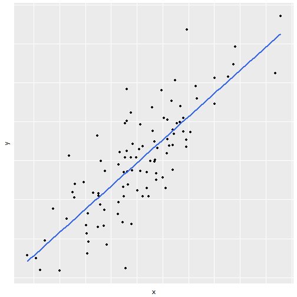
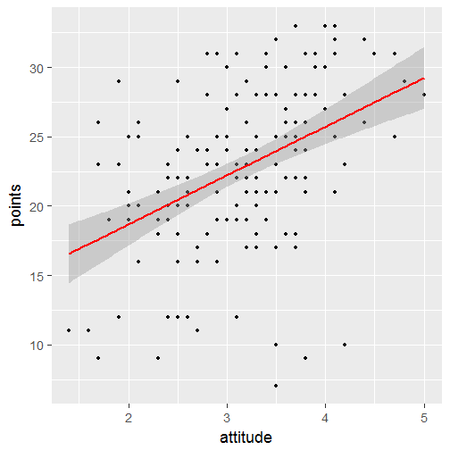

Regression and model validation
========================================================
type: sub-section

What is a statistical model?
========================================================

A statistical model 

- Embodies a set of assumptions and describes the generation of a sample from a population
- Represents the data-generating process

<!-- source: [wikipedia](https://en.wikipedia.org/wiki/Statistical_model) -->

Linear regression models (1)
========================================================

<!-- spoken: Linear regression is an approach for modeling the relationship between a scalar dependent variable $y$ and one or more explanatory variables $X$. -->

In linear regression, it is asumed that the relationship between a dependent variable $y$ and explanatory variable(s) $X$ is *linear*

$$y = a + b \cdot X$$

The goal is to estimate the unkown parameters $a$ and $b$.

Linear regression models (2)
========================================================

An unobservable random variable is assumed to add noise to the observations

$$y = a + b \cdot X + \epsilon$$

Often it is reasonable to assume $\epsilon \sim N(0, \sigma)$

<!-- source: [wikipedia](https://en.wikipedia.org/wiki/Linear_regression) -->

Applications of linear regression models
========================================================
There are many applications for linear models such as

- Prediction or forecasting
- Quantifying the strength of the relationship between $y$ and $X$

Simple regression
========================================================

In a simple case, there is only one explanatory variable $x$

$y =  a + b \cdot x + \epsilon$

***

Multiple regression (1)
========================================================

The model can also include more than one explanatory variable

$$y = a + b_1 \cdot x_1 + b_2 \cdot x_2 + \epsilon$$

***

Multiple regression (2)
========================================================

In the general case, there can be any number of explanatory variables

$$y = a + b_1 \cdot x_1 + b_2 \cdot x_2 + ... + b_d \cdot x_d + \epsilon$$

Polynomial terms
========================================================

It is also possible to add polynomial terms, if the effect of a variable is non-linear

$$y = a + b_1 \cdot x + b_2 \cdot x^2$$

***

Interaction terms
========================================================
 Finally, it is also possible to add interaction terms, if the variables can affect each other
 
 $$y = a + b_1 \cdot x_1 + b_2 \cdot x_2 + b_3 \cdot x_1 \cdot x_2$$
 
