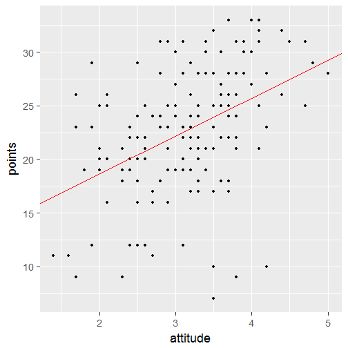
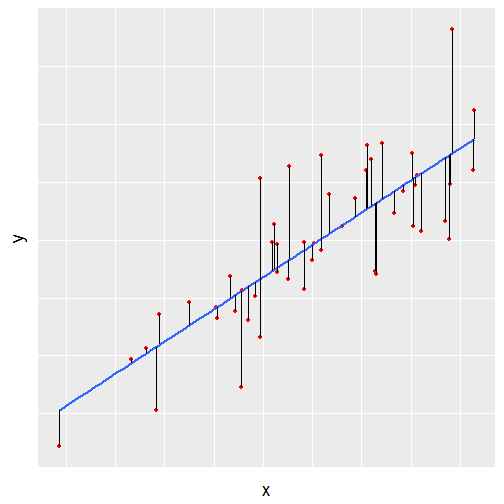
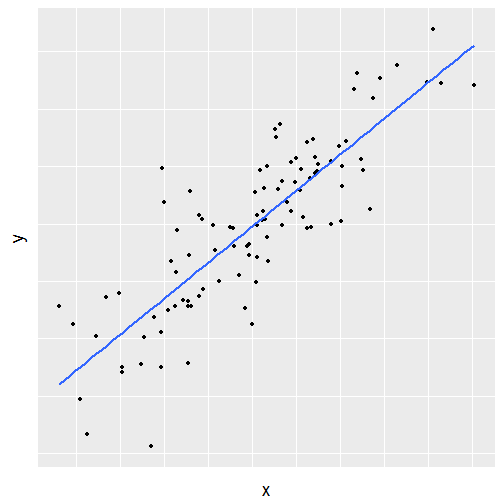
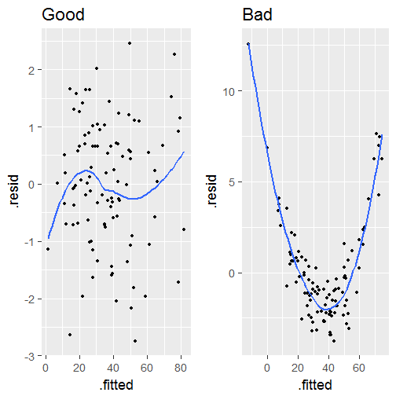
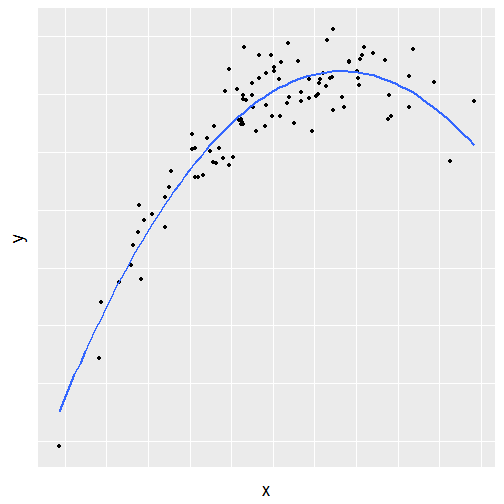

Regression and model validation
========================================================
type: sub-section

Tuomo Nieminen

========================================================
type: prompt
incremental: false

Linear regression


***

Model validation


What is a statistical model?
========================================================

A statistical model: 
- Embodies a set of assumptions and describes the generation of a sample from a population
- The model represents the data generating process
- The uncertainty related to a sample of data is described using probability distributions

<!-- source: [wikipedia](https://en.wikipedia.org/wiki/Statistical_model) -->

Linear regression models
========================================================

Linear regression is an approach for modeling the relationship between a dependent variable $\mathbf{y}$ and one or more explanatory variables $\mathbf{X}$.  

There are many applications for linear models such as

- Prediction or forecasting
- Quantifying the strength of the relationship between $\mathbf{y}$ and $\mathbf{x}$


Assumptions of linear regression models
========================================================

In linear regression, it is assumed that the relationship between $\mathbf{y}$ and  $\mathbf{X}$ is *linear*:

$$\mathbf{y} = \alpha + \mathbf{\beta} \cdot \mathbf{X} + \mathbf{\epsilon}$$

- The goal is to estimate the unkown parameters $\alpha$ and $\mathbf{\beta}$
- An unobservable random variable ($\mathbf{\epsilon}$) is assumed to add noise to the observations
- Often it is reasonable to assume $\mathbf{\epsilon} \sim N(0, \sigma^2)$

<!-- source: [wikipedia](https://en.wikipedia.org/wiki/Linear_regression) -->


Simple regression
========================================================

In a simple case, there is only one explanatory variable $\mathbf{x}$

$\mathbf{y} =  \alpha + \beta \cdot \mathbf{x} + \mathbf{\epsilon}$

R:  
```lm(y ~ x)```  

***



Multiple regression (1)
========================================================

The model can also include more than one explanatory variable

$$\mathbf{y} = \alpha + \beta_1 \cdot \mathbf{x}_1 + \beta_2 \cdot \mathbf{x}_2 + \mathbf{\epsilon}$$

R:  
```lm(y ~ x1 + x2)```  

***



Multiple regression (2)
========================================================

In the general case, there can be any number of explanatory variables

$$\mathbf{y} = \alpha + \beta_1 \cdot \mathbf{x}_1 + \beta_2 \cdot \mathbf{x}_2 + ... + \beta_d \cdot \mathbf{x}_d + \mathbf{\epsilon}$$

In matrix notation  

$$\mathbf{y} = \alpha + \mathbf{\beta} \cdot \mathbf{X} + \mathbf{\epsilon}$$

R:  
```lm(y ~ x1 + x2 + ... + xd)```  

Polynomial terms
========================================================

It is also possible to add polynomial terms, if the effect of a variable is non-linear

$$\mathbf{y} = \alpha + \beta_1 \cdot \mathbf{x} + \beta_2 \cdot \mathbf{x}^2 + \mathbf{\epsilon}$$

R:  
```lm(y ~ x + I(x^2))```  

***




Interaction terms
========================================================
 Finally, it is also possible to add interaction terms, if the explanatory variables can affect each other
 
 $$\mathbf{y} = \alpha + \beta_1 \cdot \mathbf{x}_1 + \beta_2 \cdot \mathbf{x}_2 + \beta_3 \cdot \mathbf{x}_1 \cdot \mathbf{x}_2 + \mathbf{\epsilon}$$
 
R:  
```lm(y ~ x1 + x2 + I(x1*x2))```  
