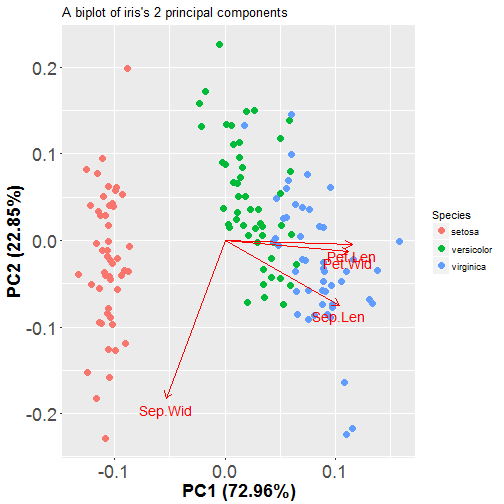
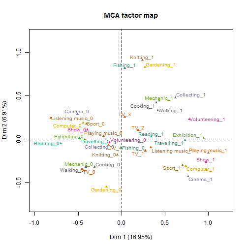

Dimensionality Reduction Techniques
========================================================
type: sub-section

For IODS by Tuomo Nieminen & Emma Kämäräinen

<br>
<br>
<br>
<br>

Powered by Rpresentation. The code for this presentation is  [here](https://raw.githubusercontent.com/TuomoNieminen/Helsinki-Open-Data-Science/master/docs/dimensionality_reduction.Rpres)


Principal component analysis
========================================================
type: prompt
incremental: false


From high...


***

.. to lower dimensionality


What is dimensionality?
========================================================

In statistical analysis, one can think of *dimensionality* as the number of variables (features) related to each observation in the data.

- If each observation is measured by $d$ number of features, then the data is $d$ dimensional. Each observation needs $d$ points to define it's location in a **mathematical space**.
- If there are a lot of features, some of them can relate to the same underlying dimensions (not directly measured)
- Some dimensions may be stronger and some weaker, they are not equally important

Dimensionality reduction
========================================================
  
The original variables of high dimensional data might contain "too much" information (and noise or some other random error) for representing the underlying phenomenom of interest.

- A solution is to reduce the number of dimensions and focus only on the **most essential dimensions** extracted from the data
- In practise we can *transform* the data and use only a few **principal components** for visualisation and/or analysis
- Hope is that the variance along a small number of principal components provides a reasonable characterization of the complete data set

Tools for dimensionality reduction
========================================================

On the linear algebra level, Singular Value Decomposition (SVD) is the most important tool for reducing the number of dimensions in multivariate data.

- The SVD literally *decomposes* a matrix into a product of smaller matrices and reveals the most important components
- Principal Component Analysis (PCA) is a statistical procedure which does the same thing
- Correspondence Analysis (CA) or Multiple CA (MCA) can be used if the data consists of categorical variables
- The classification method LDA can also be considered as a dimensionality reduction technique

Principal Component Analysis (PCA)
========================================================

In PCA, the data is first *transformed* to a new space with equal or less number of dimensions (new features). These new features are called the **principal components**. They always have the following properties:

- The 1st principal component captures the maximum amount of variance from the features in the original data
- The 2nd principal component is orthogonal to the first and it captures the maximum amount of variability left
- The same is true for each principal component. They are all **uncorreleated** and each is less important than the previous one, in terms of captured variance.

Reducing dimensionality with PCA
========================================================
incremental: false

Given the properties of the principal components, we can simply choose the first few principal components to represent our data.

This will give us uncorrelated variables which capture the maximum amount of variation in the data!

***


<small>*The dimensionality of iris reduced to two principal components (PC). The first PC captures more than 70% of the total variance in the 4 original variables.*</small>

About PCA
========================================================
Unlike LDA, PCA has no criteria or target variable. PCA may therefore be called an **unsupervised** method.  

- PCA is sensitive to the relative scaling of the original features and assumes that features with larger variance are more important than features with smaller variance.  
- **Standardization** of the features before PCA is often a good idea.
- PCA is powerful at encapsulating correlations between the original features into a smaller number of uncorrelated dimensions

About PCA (2)
========================================================
PCA is a mathematical tool, not a statistical model, which is why linear algebra (SVD) is enough.

- There is no statistical model for separating the sources of variance. All variance is thought to be from the same - although multidimensional - source.
- It is also possible to model the dimensionality using underlying latent variables with for example Factor Analysis
- These advanced methods of multivariate analysis are not part of this course

Biplots
========================================================
type: prompt
incremental: false



***
<br>
Correlations of iris

<font size = 5.5>

```
        Sep.Len Sep.Wid Pet.Len Pet.Wid
Sep.Len    1.00   -0.12    0.87    0.82
Sep.Wid   -0.12    1.00   -0.43   -0.37
Pet.Len    0.87   -0.43    1.00    0.96
Pet.Wid    0.82   -0.37    0.96    1.00
```
</font>
<br>
The correlations (and more) can be interpret from the biplot on the left, but how?


The 'Bi' in Biplots
========================================================
A biplot is a way of visualizing two representations of the same data. The biplot displays:

**(1)** The observations in a lower (2-)dimensional representation
- A scatter plot is drawn where the observations are placed on x and y coordinates defined by two principal components (PC's)

**(2)** The original features and their relationships with both each other and the principal components
- Arrows and/or labels are drawn to visualize the connections between the original features and the PC's. 

Properties of biplots
========================================================

In a biplot, the following connections hold:

- The angle between arrows representing the original features can be interpret as the correlation between the features. Small angle = high positive correlation.
- The angle between a feature and a PC axis can be interpret as the correlation between the two. Small angle = high positive correlation.
- The length of the arrows are proportional to the standard deviations of the features

Biplots can be used to visualize the results of dimensionality reduction methods such as LDA, PCA, Correspondence Analysis (CA) and Multiple CA.

Multiple Correspondence Analysis
========================================================
type: prompt
incremental: false
autosize: true




Multiple Correspondence Analysis
========================================================
incremental: false
autosize: true

<font size=6>

- Dimensionality reduction method
- Analyses the pattern of relationships of several categorical
variables
- Generalization of PCA and a extension of correspondence analysis (CA)
- Deals with categorical variables, but continuous ones can be used as background (supplementary) variables
- Can be used with qualitative data, so there are little assumptions about the variables or the data in general. MCA uses frequencies and you can count those even from text based datasets.

</font>

Multiple Correspondence Analysis
========================================================
incremental: false
autosize: true

<font size=6>

- For the categorical variables, you can either use the [indicator matrix or the Burt matrix](https://en.wikipedia.org/wiki/Multiple_correspondence_analysis#As_an_extension_of_correspondences_analysis) in the analysis
    - The Indicator matrix contains all the levels of categorical variables as a binary variables (1 = belongs to category, 0 = if doesn't)
    - Burt matrix is a matrix of two-way cross-tabulations between all the variables in the dataset
- The general aim is to condense and present the information of the cross-tabulations in a clear graphical form
- Correspondence Analysis (a special case of MCA) works similarly with a cross-table of only two categorical variables
- There are also several other variations of the CA methods

- And next, let's look how the MCA outputs look in R!

</font>

MCA summary(1)
========================================================
incremental: false
autosize: true
left: 40%

<font size=5>

Output of MCA summary contains...

- **Eigenvalues**: the variances and the percentage of variances retained by each dimension
- **Individuals**: the individuals coordinates, the individuals contribution (%) on the dimension and the cos2 (the squared correlations) on the dimensions.

</font>

***

<font size=4>


```

Call:
MCA(X = data, graph = FALSE, method = "indicator") 


Eigenvalues
                       Dim.1   Dim.2   Dim.3   Dim.4
Variance               0.413   0.334   0.330   0.256
% of var.             30.992  25.053  24.743  19.212
Cumulative % of var.  30.992  56.045  80.788 100.000

Individuals (the 3 first)
          Dim.1    ctr   cos2    Dim.2    ctr   cos2    Dim.3    ctr
1      |  0.283  0.065  0.056 | -0.283  0.080  0.056 | -0.534  0.288
2      |  1.055  0.898  0.802 | -0.431  0.185  0.134 | -0.209  0.044
3      |  0.138  0.015  0.035 | -0.048  0.002  0.004 | -0.103  0.011
         cos2  
1       0.199 |
2       0.032 |
3       0.019 |

Categories (the 3 first)
           Dim.1     ctr    cos2  v.test     Dim.2     ctr    cos2  v.test
Label1 |   1.199  28.599   0.471  11.862 |  -0.786  15.197   0.202  -7.775
Label2 |  -0.569  16.801   0.584 -13.214 |  -0.121   0.935   0.026  -2.803
Label3 |   0.639   3.627   0.051   3.887 |   2.468  66.852   0.753  15.002
           Dim.3     ctr    cos2  v.test  
Label1 |  -0.274   1.875   0.025  -2.714 |
Label2 |  -0.092   0.553   0.015  -2.142 |
Label3 |   1.154  14.813   0.165   7.018 |

Categorical variables (eta2)
         Dim.1 Dim.2 Dim.3  
Var1   | 0.608 0.832 0.171 |
Var2   | 0.079 0.154 0.741 |
Var3   | 0.553 0.017 0.078 |
```

</font>

MCA summary(2)
========================================================
incremental: false
autosize: true
left: 40%

<font size=5>

Output of MCA summary contains...

- **Categories**: the coordinates of the variable categories, the contribution (%), the cos2 (the squared correlations) and v.test value. The v.test follows normal distribution: if the value is below/above $\pm$ 1.96, the coordinate is significantly different from zero.
- **Categorical variables**: the squared correlation between each variable and the dimensions. If the value is close to one it indicates a strong link with the variable and dimension.

</font>

***

<font size=4>


```

Call:
MCA(X = data, graph = FALSE, method = "indicator") 


Eigenvalues
                       Dim.1   Dim.2   Dim.3   Dim.4
Variance               0.413   0.334   0.330   0.256
% of var.             30.992  25.053  24.743  19.212
Cumulative % of var.  30.992  56.045  80.788 100.000

Individuals (the 3 first)
          Dim.1    ctr   cos2    Dim.2    ctr   cos2    Dim.3    ctr
1      |  0.283  0.065  0.056 | -0.283  0.080  0.056 | -0.534  0.288
2      |  1.055  0.898  0.802 | -0.431  0.185  0.134 | -0.209  0.044
3      |  0.138  0.015  0.035 | -0.048  0.002  0.004 | -0.103  0.011
         cos2  
1       0.199 |
2       0.032 |
3       0.019 |

Categories (the 3 first)
           Dim.1     ctr    cos2  v.test     Dim.2     ctr    cos2  v.test
Label1 |   1.199  28.599   0.471  11.862 |  -0.786  15.197   0.202  -7.775
Label2 |  -0.569  16.801   0.584 -13.214 |  -0.121   0.935   0.026  -2.803
Label3 |   0.639   3.627   0.051   3.887 |   2.468  66.852   0.753  15.002
           Dim.3     ctr    cos2  v.test  
Label1 |  -0.274   1.875   0.025  -2.714 |
Label2 |  -0.092   0.553   0.015  -2.142 |
Label3 |   1.154  14.813   0.165   7.018 |

Categorical variables (eta2)
         Dim.1 Dim.2 Dim.3  
Var1   | 0.608 0.832 0.171 |
Var2   | 0.079 0.154 0.741 |
Var3   | 0.553 0.017 0.078 |
```

Read more from [here](http://www.sthda.com/english/wiki/multiple-correspondence-analysis-essentials-interpretation-and-application-to-investigate-the-associations-between-categories-of-multiple-qualitative-variables-r-software-and-data-mining) and [here](http://factominer.free.fr/classical-methods/multiple-correspondence-analysis.html)

</font>


MCA biplot(1)
========================================================
incremental: false
autosize: true

<font size=5>

Visualizing MCA:
- You can plot for variables, individuals and background (supplementary variables) separately or you can draw them in the same plot. 
- `plot.MCA()` function in R (from FactoMineR) has a lot of options for plotting
- See a [video](https://www.youtube.com/watch?v=reG8Y9ZgcaQ) of MCA (plotting options start at 5:36).
- Let's look at a minimal example on the next slide.

</font>

MCA biplot(2)
========================================================
incremental: false
autosize: true
left: 50%

<font size=5>

- On the right we have MCA factor map (biplot), where are variables drawn on the first two dimensions
    - The MCA biplot is a good visualization to see the possible variable patterns
    - The distance between variable categories gives a measure of their similarity
    - For example Label2 and Name2 are more similar than Label2 and Level2 and Label3 is different from all the other categories


</font>

***


