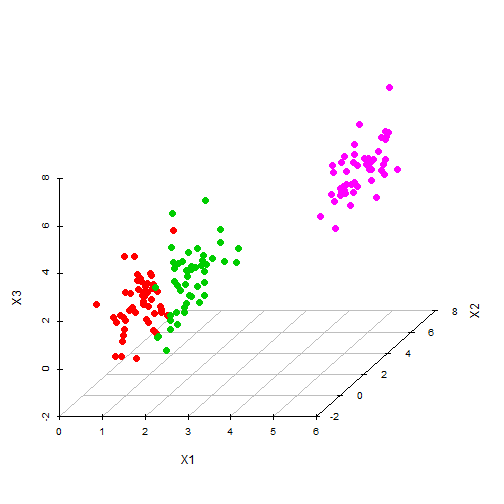
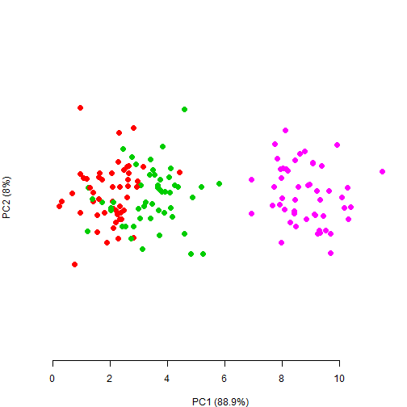
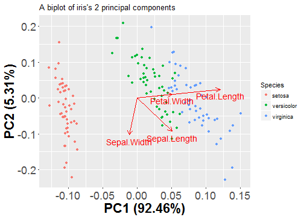

Dimensionality Reduction Techniques
========================================================
type: sub-section

For IODS by Tuomo Nieminen

 
 
 
 

Powered by RMarkdown. The code for this presentation is  [here.](https://github.com/TuomoNieminen/Helsinki-Open-Data-Science/blob/master/docs/dimensionality_reduction.Rpres)

Pricipal component analysis
========================================================
type: prompt
incremental: false

From high...

***

.. to lower dimensionality

What is dimensionality?
========================================================

In statistical analysis, one can think of *dimensionality* as the number of variables (features) related to each observation in the data.

- If each observation is measured by $d$ number of features, then the data is $d$ dimensional. Each observation needs $d$ points to define it's location in a mathematical space.
- If there are a lot of features, some of them can relate to the same underlying dimensions (not directly measured)
- Some dimensions may be stronger and some weaker, they are not equally important

Dimensionality reduction
========================================================
  
The original variables of high dimensional data might contain "too much" information (and noise or some other random error) for representing the underlying phenomenom of interest

- A solution is to reduce the number of dimensions and focus only on the most essential dimensions extracted from the data
- In practise we can *transform* the data and use only a few *principal components* for visualisation and/or analysis
- Hope is that the variance along a small number of principal components provides a reasonable characterization of the complete data set

Tools for dimensionality reduction
========================================================

On the linear algebra level, Singular Value Decomposition (SVD) is the most important tool for reducing the number of dimensions in multivariate data.

- Principal Component Analysis (PCA) is an important statistical procedure which does the same thing
- LDA can also be considered a dimensionality reduction technique. The visualisation techniques related to PCA and LDA are similar (biplot)
- Unlike LDA, PCA has no criteria or target variable for the reduction. In machine learning vocabulary, PCA may be called an *unsupervised* method.

Pricipal component analysis (PCA) (1)
========================================================

In PCA, the data is first *projected* to a new space with the same number of dimensions (new features). These new features always have the following properties:

- The first dimension (1st principal component) captures the maximum amount of variance from the features in the original data.
- The second dimension (2nd principal component) is orthogonal to the first (they are uncorrelated) and captures the maximum amount of variability left.
- The same is true for each principal component. They are all orthogonal and each is "less important" than the previous one, in terms of captured variability.

Principal component analysis (PCA) (2)
========================================================

Given the properties of the principal components, we can simply **choose the first few principal components** to represent our data.

This will give us uncorrelated variables which capture the maximum amount of variation in the data!

***

*The dimensionality of iris reduced to two principal components (PC). The first PC captures more than 90% of the total variance in the 4 original variables.*

About PCA
========================================================
PCA is a mathematical tool, not a statistical model, which is why linear algebra (SVD) is enough.

- PCA is most powerful at encapsulating linear relationships (correlations)
- There is no statistical model for separating the sources of variance. All variance is thought to be from the same - although multidimensional - source.
- It is also possible to model the dimensionality using underlying latent variables with for example Factor Analysis
- The advanced methods of multivariate analysis are not part of this course
