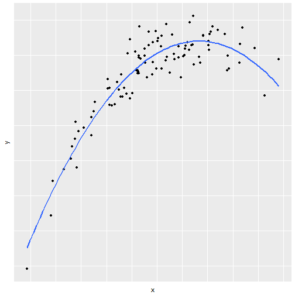
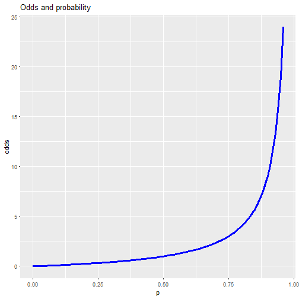

Introduction to Open Data Science
========================================================
incremental: true
autosize: true
transition: none

University of Helsinki, spring 2017
- prof. Kimmo Vehkalahti with  
- Tuomo Nieminen and Emma Kämäräinen  

========================================================
type: prompt


Contents
========================================================
incremental: false

- Regression and model validation  
- Logistic regression
- Clustering and classification  
- Dimensionality reduction techniques  
- Multivariate statistical modelling   


Linear regression and model validation
========================================================
type: sub-section

Tuomo Nieminen

<br>
<br>
<br>

code for this presentation [here](https://raw.githubusercontent.com/TuomoNieminen/Helsinki-Open-Data-Science/master/docs/chapter1.Rpres)

Linear regression models
========================================================
type: prompt
incremental: false


***


What is a statistical model?
========================================================

A statistical model: 
- Embodies a set of assumptions and describes the generation of a sample from a population
- The model represents the data generating process
- The uncertainty related to a sample of data is described using probability distributions

<!-- source: [wikipedia](https://en.wikipedia.org/wiki/Statistical_model) -->

Linear regression models
========================================================

Linear regression is an approach for modeling the relationship between a dependent variable $\boldsymbol{y}$ and one or more explanatory variables $\boldsymbol{X}$.  

There are many applications for linear models such as

- Prediction or forecasting
- Quantifying the strength of the relationship between $\boldsymbol{y}$ and $\boldsymbol{x}$


Simple regression
========================================================

In a simple case, the model includes one explanatory variable $\boldsymbol{x}$

$\boldsymbol{y} =  \alpha + \beta \boldsymbol{x} + \boldsymbol{\epsilon}$

R:  
```lm(y ~ x)```  

***


Assumptions of linear regression models
========================================================

In linear regression, it is assumed that the relationship between the target variable $\boldsymbol{y}$ and the parameters ($\alpha$ ,$\boldsymbol{\beta}$) which describe the relationship with $\boldsymbol{X}$, is *linear*:

$$\boldsymbol{y} = \alpha +  \boldsymbol{X} \boldsymbol{\beta} + \boldsymbol{\epsilon}$$

- The goal is to estimate the parameters $\alpha$ and $\boldsymbol{\beta}$
- An unobservable random variable ($\boldsymbol{\epsilon}$) is assumed to add noise to the observations
- Often it is reasonable to assume $\boldsymbol{\epsilon} \sim N(0, \sigma^2)$

<!-- source: [wikipedia](https://en.wikipedia.org/wiki/Linear_regression) -->


Structure of a linear model
========================================================
In the linear equation $\boldsymbol{y} =  \alpha + \beta \boldsymbol{x} + \boldsymbol{\epsilon}$:

- $\boldsymbol{y}$ is the target variable: we wish to predict the values of $\boldsymbol{y}$ using the values of $\boldsymbol{x}$.
- $\alpha + \beta \boldsymbol{x}$ is the systematic part of the model.
- $\beta$ quantifies the relationship between $\boldsymbol{y}$ and  $\boldsymbol{x}$.
- $\boldsymbol{\epsilon}$ describes the errors of the model

Multiple regression
========================================================

The model can also include more than one explanatory variable

$$\boldsymbol{y} = \alpha + \beta_1 \boldsymbol{x}_1 + \beta_2 \boldsymbol{x}_2 + \boldsymbol{\epsilon}$$

R:  
```lm(y ~ x1 + x2)```  

***



Finding the model
========================================================
A requirement for finding the best model is to minimize the prediction errors that the model makes

- $\hat{\boldsymbol{y}} = \hat{\alpha} + \hat{\beta} \boldsymbol{x}$ are the predictions
- $\hat{\boldsymbol{y}} - \boldsymbol{y}$ are the prediction errors
- The best possible model is found by minimizing the sum of squared errors

***


Interpreting the parameters
========================================================
When the model is $$\boldsymbol{y} = \alpha + \beta_1 \boldsymbol{x}_1 + \beta_2 \boldsymbol{x}_2 + \boldsymbol{\epsilon}$$

- The main interest is to estimate the $\beta$ parameters
- Interpretation of $\hat{\beta_1} = 2$: 
  - When $x_1$ increases by one unit, the average change in $y$ is 2 units, given that the other variables (here $x_2$) do not change.


Advanced example: Polynomial terms
========================================================

The linearity assumption isn's as restrictive as one could imagine.  

It is possible to add polynomial terms to the model, if the effect of a variable is non-linear

$$\boldsymbol{y} = \alpha + \beta_1 \cdot \boldsymbol{x} + \beta_2 \cdot \boldsymbol{x}^2 + \boldsymbol{\epsilon}$$

R:  
```lm(y ~ x + I(x^2))```  

***


Model validation
========================================================
type: prompt


Model assumptions
========================================================
A statistical model always includes several assumptions which describe the data generating process.  

- How well the model describes the phenomenom of interest, depends on how well the assumptions fit reality.
- In a linear regression model an obvious assumption is linearity: The target variable is modelled as a linear combination of the model parameters.
- Usually it is assumed that the errors are normally distributed.


Assumptions of linear regression models
========================================================
Analyzing the *residuals* of the model provides a method to exlopore the validity of the model assumptions. A lot of interesting assumptions are included in the expression 

$$\boldsymbol{\epsilon} \sim N(0, \sigma^2)$$

- The errors are normally distributed
- The errors are not correlated
- The errors have constant variance, $\sigma^2$
- The size of a given error does not depend on the explanatory variables

Normality of the errors (QQ-plot)
========================================================

QQ-plot of the residuals provides a method to explore the assumptio that the errors of the model are normally distributed

Constant variance of errors
========================================================

The constant variance assumption implies that the size of the errors should not depend on the explanatory variables. This can be explored with a simple scatter plot of residuals and model predictions.


Advanced: Leverage of observations
========================================================

Residuals vs leverage

