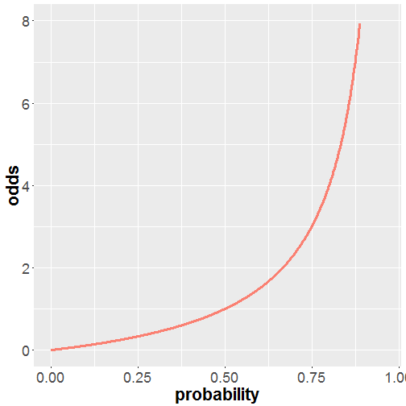
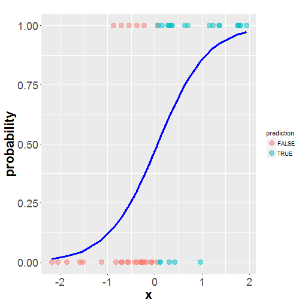
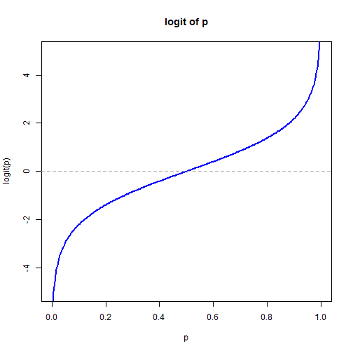
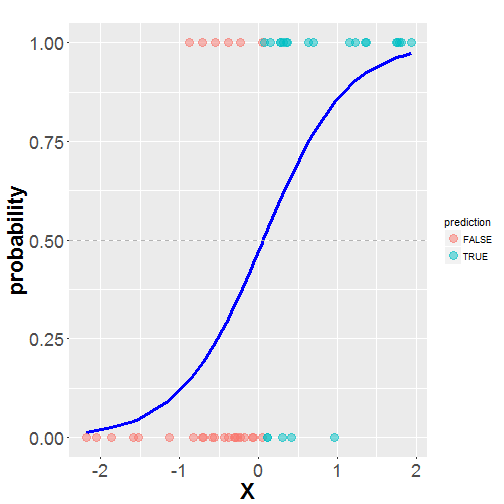

Logistic regression and cross-validation
========================================================
type: sub-section

For IODS by Tuomo Nieminen

 
 
 
 

Powered by RMarkdown. The code for this presentation is  [here.](https://github.com/TuomoNieminen/Helsinki-Open-Data-Science/blob/master/docs/logistic_regression.Rpres)

Logistic regression
========================================================
type: prompt
incremental: false

Odds and probability

***

Predicting binary outcomes

A conditional look at regression
========================================================

In regression analysis, the target variable $\boldsymbol{Y}$ is modelled as a linear combination of the model parameters and the explanatory variables $\boldsymbol{X}$

$$\boldsymbol{Y} = \boldsymbol{\alpha} + \boldsymbol{\beta}\boldsymbol{X} + \boldsymbol{\epsilon}$$

Another way to express this is to use *conditional expectation*

$$E[\boldsymbol{Y} \mid \boldsymbol{X}] = \boldsymbol{\alpha} + \boldsymbol{\beta}\boldsymbol{X}$$

So, linear regression is a model for the (conditional) expected value of Y.

Regression for binary outcomes
========================================================

If the target variable $Y$ is *binary*, taking only the values 0 ("failure") or 1 ("success"), with probability $p$, then 

$$E[Y] = p$$

- **The goal** in logistic regression is to define a linear model for the probability of "success" ($p$, the expected value of $Y$)
- The problem is that $p$ only takes on values between 0 and 1
- A possible predictor can take on any value. There is no way to use multiplication and addition to restrict the predictors values to the range of $p$. What to do?

Odds
========================================================

The ratio of expected "successes" to "failures" are called the odds:

$$\frac{p}{1-p}$$

- Odds are an alternative way of expressing probabilities
- Higher odds corresponds to a higher probability of success
- The value of odds ranges from zero to infinity

***

<small> *Odds of 2 to 1: the probability of success is twice as likely as the probability of failure, when p = 2/3.*</small>
 

The logit function
========================================================
incremental: false

To transform $p$ into a completely unrestricted scale, we can take the logarithm of odds:

$$log\left( \frac{p}{1 - p} \right) \in [- \infty, \infty]$$

- The (natural) logarithm of odds is called the *logit function*.
- The possible values are all the real numbers (unrestricted).

***

Simple logistic regression
========================================================

In a simple case, the logistic regression model for the expected value $p$ of a binary variable $Y$, is:

$$log\left( \frac{\boldsymbol{p}}{1 - \boldsymbol{p}} \right) = \alpha + \beta \boldsymbol{x} + \boldsymbol{\epsilon}$$

R:  
`glm(Y ~ X, family = "binomial")`

***
 

Odds ratio
========================================================

The ratio of two odds is called the odds ratio. It can be computed by the following steps:

1. Compute the odds of "success" ($Y = 1$) for individuals who have the property $X$. 
2. Compute the odds of "success" ($Y = 1$) for individuals who **do not** have property $X$.
3. Divide the odds from step 1 by the odds from step 2 to obtain the odds ratio (OR).

Odds ratio can be used to quantify the relationship between $X$ and $Y$. Odds **higher than 1** mean that $X$ is **positively associated** with "success".

Odds ratio example (1)
========================================================

- *X = "has X"*
- *X_ = "doesn't have X"*
- *1 = "success"*
- *0 = "failure"*

<small>toy data:</small>

|      |  X| X_| total|
|:-----|--:|--:|-----:|
|1     | 10| 16|    26|
|0     | 15|  4|    19|
|total | 25| 20|    45|

***

The following probabilities can be calculated from the (toy) data:  

- $P(Y = 1 \mid X) = 10 / 25 = 0.4$
- $P(Y = 0 \mid X) = 15 / 25 = 0.6$
- $P(Y = 1 \mid X\_) = 16 / 20  = 0.8$
- $P(Y = 0 \mid X\_) = 4 / 20 = 0.2$  

Odds ratio example (2)
========================================================
left: 85%

Odds is the ratio of successes to failures:

- $Odds(Y \mid X) = \frac{P(Y = 1 \mid X)}{P(Y = 0 \mid X)} = \frac{0.4}{0.6} = \frac{2}{3}$
- $Odds(Y \mid X\_) = \frac{P(Y = 1 \mid X\_)}{P(Y = 0 \mid X\_)} =\frac{0.8}{0.2} = 4$

Odds ratio (OR) is the ratio of the two odds:

$$OR = \frac{Odds(Y \mid X)}{Odds(Y \mid X\_)} = \frac{2/3}{4} = \frac{1}{6}$$

***
     

<small>toy data:</small>

|      |  X| X_| total|
|:-----|--:|--:|-----:|
|1     | 10| 16|    26|
|0     | 15|  4|    19|
|total | 25| 20|    45|

Interpreting the parameters of logistic regression
========================================================
From the fact that the computational target variable in the logistic regression model is the log of odds, it follows that applying the exponent function to the fitted  values gives the odds:

$$\exp \left( log\left( \frac{\hat{\boldsymbol{p}}}{1 - \hat{\boldsymbol{p}}} \right) \right) = \frac{\hat{\boldsymbol{p}}}{1 - \hat{\boldsymbol{p}}}.$$

The exponents of the coefficients can be interpret as odds ratios between a unit change (vs no change) in the corresponding explanatory variable.

$$exp(\hat{\beta_x}) = Odds(Y \mid x + 1) / Odds(Y \mid x)$$

Cross-validation
========================================================
type: prompt

 
<small>*https://prateekvjoshi.files.wordpress.com/2013/06/cross-validation.png*</small>

Training and testing sets
========================================================

A statistical model can be used to make predictions. An intuitive way of comparing different models is to test their predictive power on unseen data.

- The available data can be split into training and testing sets
- Only the training data is used to find the model
- The testing data is then used to make predictions and evaluate the model performance

</img>

Accuracy and error
========================================================
In order to assert model performance, we need to measure it somehow. 

- Depending on the nature of the target variable, different measures might make sense.
- If the task is *binary classification* such as in logistic regression, it is straight forward to calculate the proportion of correctly classified observations
- The proportion of incorrectly classified observations is the error (penalty, loss)

Cross-validation (1)
========================================================
Cross-validation is a powerful general technique for assessing how the results of a statistical analysis will generalize to an independent data set.

- Utilizes the idea of training and testing sets effectively
- Mainly used in settings where one wants to estimate how accurately a predictive model will perform in practice
- Gives a reasonable measure of performance on unseen data
- Can be used to compare different models to choose the best performing one

Cross-validation (2)
========================================================

One round of cross-validation involves 

- Partitioning a sample of data into complementary subsets
- Performing the analysis on one subset (the training set, larger)
- Validating the analysis on the other subset (the testing set, smaller). 

This process is repeated so that eventually all of the data is used for both training and testing.

K-fold cross-validation
========================================================

Below is an example of 4-fold cross-validation 

The data is divided into subsets K times and eventually all the data is used for both training and testing.  
