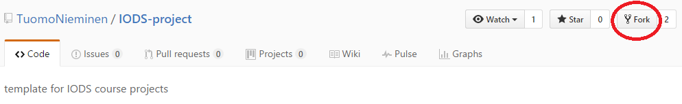
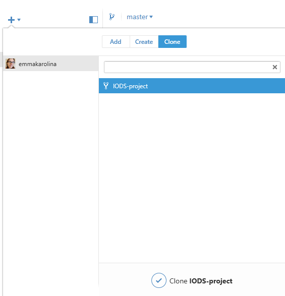
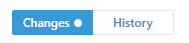
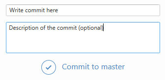
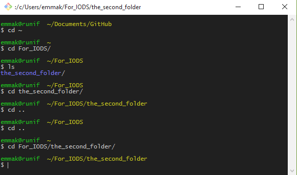
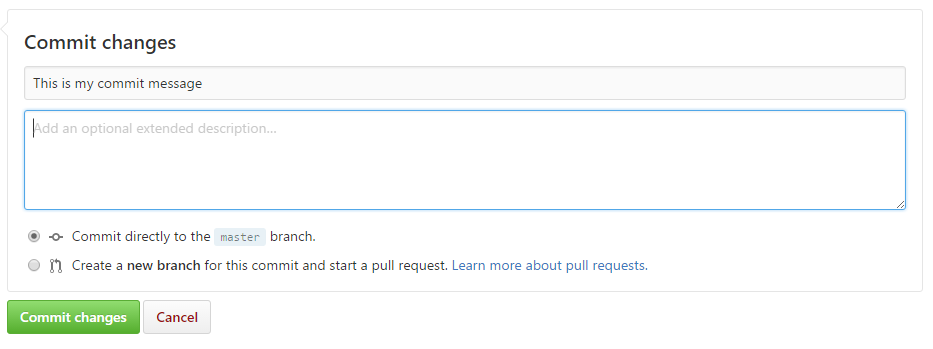
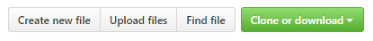

# Github

[Why use Github?](http://kbroman.org/github_tutorial/pages/why.html) Git is a widely used version control software that helps keep track of your files, so that in case of an accident you can always restore a previous version. GitHub helps you host these (version controlled) files on the web, so you can access your files from anywhere and share them with others. 

During this course, you will learn the basics of Github. You will use Github to store your course files and return weekly exercises. To get started on using GitHub, follow the steps outlined in this document

## Basics

First, you will need to create a Github account.

- Create an Github account at [https://github.com/](https://github.com/)

On GitHub, a group of files belonging to a single project is called a *repository*. A repository is like the main folder of a single project on your computer, under which are the files related to the project.

To help you to get started, we have created a GitHub repository which serves as a project template for you during this course. The next step is to copy that template so that you have your own version of it in your GitHub account.

## The course project template

Follow the steps below to get yourself the course project template for weekly exercises and your course diary.

- Go to https://github.com/TuomoNieminen/IODS-project and get yourself the course project template by pressing the *Fork* button.  

- After forking the repository you will have the "IODS-project" repository under your own profile github.com/*your_github_username*/IODS-project

The forked repository holds the template files for your weekly course exercises and your course diary. There are R markdown (.Rmd) files for every week of the course. You will modify them as the course goes on. There is also one index.Rmd file and an index.html file, which combine the weekly exercises to a single publishable course diary web page.

## The course diary web page

Any GitHub repository can automatically create a web page if an index.html document is included in the repository. The repository you just forked already includes such a document. 

To enable your own course diary web page do the following. In your **own version** of the course project template (i.e. the repository at github.com/*your_github_username*/IODS-project):

- Go to **Settings** (topright) and then scoll down to **GitHub Pages**
- If you immidiately see a green checkmark and the text "Your site is published at http..." then no action is necessary and that's the address to your course diary web page.
- If not: under **Source** select the option **master branch** and click **save**. The green checkmark and the above text should appear with the link to your course diary page.
- Open the link to your course diary web page. At the end of this course, all your weekly exercises will be seen there.
- Your course diary web page is at *your_github_username*.github.io/IODS-project

**Summary**: You have now created your own GitHub account, forked the course project template repository and enabled a web page which combines your weekly exercises to a single course diary web page. Great! Now let's look at how to work with GitHub from your own computer.

# Working with Github

The idea of GitHub is to publish, keep track of and store work that you are doing on your local computer. For this you basically need two things:

1. A local copy of the GitHub repository on your own computer
2. A way to upload (push) the changes you make locally, into your remote GitHub repository

There are different ways to achieve this. Github Desktop is a software that makes it easy to use Github. We recommend that you use it and present instructions for it below as option 1. Another option is to use Git, a command line type user interface. This second option is also suitable for Linux users. The third option is to manually make changes to the GitHub repository using the repository's editor. The last option we do not recommend unless you can't work on your own computer. See the note below.

The instructions for Github Desktop, Git and the GitHub editor are below. 

**Note**: The purpose of GitHub Desktop and Git is to make it easier to manage and keep in sync your local files and your remote GitHub repository. If you are doing exercises on a university computer, you will not be able to use GitHub Desktop. Instead, you will need to upload the files manually on the Github repository. This is straight forward. See 'Adding files at the Github website' for more details.

## Option 1: GitHub Desktop  

Here we describe how to download the GitHub Desktop client, how to create a local copy of your GitHub repository and how to sync files between your local (computer) and remote (GitHub) copy. 

### Downloading and getting started 

Follow the steps below.

- Download Github Desktop from [https://desktop.github.com/](https://desktop.github.com/).  
- Install the software. The installation instructions can be seen [here](https://help.github.com/desktop/guides/getting-started/installing-github-desktop/).
- Open and sign in into the Github Desktop with the same username and password you used signing into Github.
- **KESKEN(?). Is there a need to configure Git as in [GitHubs own instructions](https://help.github.com/desktop/guides/getting-started/configuring-git-for-github-desktop/)?**

### Creating a local copy of a repository

Next, you will create a copy(clone) of the IODS-project repository -which you already forked earlier - to your computer. To do that in Github Desktop, follow the instructions below. To do that in Git, see Github's instructions [here](https://help.github.com/articles/cloning-a-repository/).

In Github Desktop:
- Click the + -mark at the left corner of GitHub desktop 
- Choose the 'Clone' tab and choose the IODS-project repository
- Click on 'Clone IODS-project' and save the folder into your computer in a location of your choosing

Now when you make changes to the course files on your computer, you can upload the changes to GitHub by *syncing* the changes with Github Desktop, which is what we'll look at next.

### Syncing files

When you make changes to the (repository) files in your computer, they appear in the Changes at Github Desktop
 

To push these changes to Github, you will need to first *commit* your changes. In short, you will write a small message that describes the changes you have done. It is useful to make commits often and even on small changes. Commits are at the heart of the version control system: a single commit is a single version of the file.

- Commit messages should be short and descrive. 
- Commits are important: you can revert back to them, or undo them. 
- Clear messages help you to locate the correct version later
  

Uploading local changes to your online GitHub repository:

1. Select files you have changed and write a commit message related to those files.
2. Use the 'Commit to master' button to create the commit. 
3. Possibly repeat 1 and 2 for some other files you have changed, with different commit messages.
4. Upload (*push*) the changes to Github by using the sync button in the right corner of GitHub Desktop.

Using the sync button will push (upload) the changes from your computer to Github. The sync buttong will also *pull* (download) possible changes from Github. 

**Important**: It is important that you continue working from the latest version of your files. If you have done manual changes in your Github repository (meaning you have used GitHubs web editor to change files) or have used another computer to upload changes, **then always sync first** to fetch the up-to-date files from Github before you start working on the files again.

After syncing you can go to your Github profile (github.com/*your_github_username*/IODS-project) to see the changes appear there after a few seconds.

## Option 2: Git

If you can't / don't want to use GitHub Desktop to manage between your local files and your remote GitHub version, you can use the *Terminal* or *Git* to create commits, push (upload) changes to GitHub and pull (download) changes from GitHub. 

In any case you will need the version control software Git, which you can download from [here](https://git-scm.com/downloads). If you want to, you can also use Git Shell, that comes with Github Desktop. These instructions apply for both Git and Git Shell.

Git can be used to push and pull files from Github. In Windows, you can open Git  from the start menu of your computer. If you are using Git Shell, you can start it from Github Desktop by right-clicking the repository name.

In Mac, you can use the Terminal. You find the Terminal either in the Applications, or you can press `Command + Space` and write 'Terminal' in the opening box. For the rest of the instructions, Git instructions also apply for the Terminal. 

### Navigate with Git / Terminal

When in Git or Terminal, the first thing to do is to navigate into the folder of you repository. It is good to keep in mind that.

- When Git opens, you can see the path to the current working directory in the first line. 
- When you open Git you will need to navigate to your repository folder in your computer.
- Git usually opens in the "Documents" or "Github" -folder. If all you can see is `~`, then you are in the user home file of your computer.  

In order to navigate in Git / Terminal, you will find these tips useful:  

- You can list all the files that are in the folder that you are in with the command `ls`. If there is not anything in the folder, then nothing is listed.
- The command `cd <foldername>` will get you to the next folder. Try it out and notice how the path changes. Note that you can write the whole path to your Github repository folder at once, if you remember the path. Tip! You can use the `TAB` button to autocomplete path names.
- To get to the previous folder, you can type `cd ..` Try moving between folders to see how it works.
- Type `cd ~` to get to the user file. You can use this command anytime. Try `ls` to list all the files that you have in that folder.

Example:
    

### Operate with Git

You can use Git to add files, create commits, sync the changes or pull files from Github. The commands for these are

|        |               |
| ----------------- |---------------------------------------------------- |
| git status    | List the changed files and/or files you still need to add or commit |
| git pull | Fetch (and merge) the files from Github    |
| git add <filename> | Add the (changed) file to Github |
| git commit -m "message" | Creates a commit message to the (changed) files that you have added |
| git push | Send changes to Github |
 

The command `git pull` fetches the files from your Github repository. You should keep the files in your computer up-to-date with Github and vice versa. To send *or push* the files to Github use `git push`. In Github Desktop pulling and pushing files happens with the sync button, but in Git you have two separate commands. 

The command `git status` tells the status of your files. For example after modifying the files, you can see which files are changed.

To start the process of sending a changed file to Github, you will need to use `git add "file_name"`. Note that you will need to write the file name after the command.  After specifying which file(s) you want to push to Github, write a commit message about the changes: this can be done with `git commit -m "message_here"`. Message should be about what changes you have done. You can add multiple files and then commit them with one commit or you can add one file and commit it at the time.

Roughly, the order of command to push files to Github is: 

- (git status) 
- git pull 
- (git status) 
- *some awesome coding* 
- (git status)
- git add *file you worked on*
- (git status)
- git commit -m "message about what you did"
- (git status)
- git push
- (git status)

You can see the changes you made in your Github profile (https://github.com/*your_github_username*/IODS-project).

## Clone the repository with Git

Cloning the repository in Git, see Github's instructions [here](https://help.github.com/articles/cloning-a-repository/). Note that you will need to navigate into the folder where you want to copy the files. If username and password are asked, use your Github account credentials.

## Option 3: Adding files at the Github website

It is possible to add and/or change files directly at the Github website. However, we recommend that you use either Github Desktop or Git (or similar software) at this course because adding the files with copy/paste method is not very productive or effective in the long run.

In your repository, you can open files by simply clicking the file name. After opening a file, on the right you have a edit button, where you can modify the file. You can then directly write to the file, or for example copy and paste the contents of a file from elsewhere to that file.

After editing the file, you will need to write a commit (and description of the commit, if you wish) in a box at the bottom of the page. Then you can save the changes to your repository by clicking the 'Commit changes' button.

**Summary**: At this point you will have a hunch how to use version control (Github Desktop or Git / Terminal). You have the (forked) repository IODS-project under your GitHub account and you have it copyed (cloned) locally on your computer.

You should also install R and RStudio (instructions for those are here(add link)) if you have not done that already. You will need them in the small Github exercise.

# Small Github Exercise

The point of this small exercise is to get you started on using Github. 

In this exercise you will create a README file which will include a description of the course and the course project. GitHub repositories typically include a README file which tells what the project is about or other useful information about the repository. See below how to add a README-file to your IODS-project repository!

1. Create a .RMarkdown file with RStudio (File > New File > R Markdown). RStudio prompts for a title. The output of the title will be removed, so it does not matter in this case. Just press Ok.

2. When the new file opens, RStudio has some examples for you in there. They can be useful to look at, but for this exercise we do not need them. Delete everything in the file, including the first rows that define the title, author, date and output. You are left with a blank file.

3. Write something about this course in the file. You can use RMarkdown syntax: headers, tables, lists etc. Also include a link to your course diary web page.
(**Advanced** : If you want to include R-code output to the readme document, you can convert the .Rmd to an .md file using the knit() function in the knitr library, e.g knit(input="readme.Rmd, output="README.md").)

4. Save the file in your computer in the IODS-Project folder as 'README.Rmd'.

5. Upload the Changes to Github
    + In GitHub Desktop: Choose the project folder. You can see the file you created in the changes-tab. Write a commit message for the changes, 'commit to the master' and sync. 
    + In Git or Terminal: go to your repository folder in your computer. If your repository is up to date with the Github repository (note: use `git status` and then maybe `git pull`), you can add the new file with `git add README.Rmd`. Then write a commit message for the changes with `git commit -m "commit_message_here"`. Then use the command `git push` to push the changes to Github. You can use `git status` at any point to see the process.
    + If you can't use Github Desktop or Git you can add README file directly in the webpage into your repository with 'Create new file' or Upload files'.
    
    
6. After a few moments, go to https://github.com/*your_github_username*/IODS-project to see what have changed. 

# Useful links

- R: https://www.r-project.org/
- RStudio: https://www.rstudio.com/
- RMarkdown: http://rmarkdown.rstudio.com/
- Github: https://github.com/
- Github Desktop: https://desktop.github.com/
- Git: https://git-scm.com/

- [Basic R cheatsheet](https://www.rstudio.com/wp-content/uploads/2016/10/r-cheat-sheet-3.pdf)
- Videos for learning RStudio and RMarkdown (Arho Toikka): https://www.youtube.com/playlist?list=PLjz3inNXiF4_QIEOwhwK0sC0ePO5xufJ8 
- Github instructions (add link)
- Datacamp exercises (add link)
    + If you are signed in at mooc.helsinki.fi, the DataCamp link above will automaticly create a DataCamp account for you and no login is needed.
    + Your DataCamp username is the same as the email address you used to sign in at the mooc area. DataCamp will email your password for you after you have first visited the site. 
    + **Please check that you have logged in when going to DataCamp through the mooc area.**
    

## RMarkdown
- [HTML Documents](http://rmarkdown.rstudio.com/html_document_format.html)
- [Themes](http://bootswatch.com/)
- [R chunks](http://rmarkdown.rstudio.com/authoring_rcodechunks.html)
- [Cheat sheet](https://www.rstudio.com/wp-content/uploads/2015/02/rmarkdown-cheatsheet.pdf)
- [Basic RMarkdown](http://rmarkdown.rstudio.com/authoring_basics.html)
- [More about RMarkdown](http://rmarkdown.rstudio.com/authoring_pandoc_markdown.html#raw_html)

## Useful R-packages
- [ggplot2](http://ggplot2.org/) [cheat sheet](https://www.rstudio.com/wp-content/uploads/2015/03/ggplot2-cheatsheet.pdf)
- dplyr [cheat sheet](https://www.rstudio.com/wp-content/uploads/2015/02/data-wrangling-cheatsheet.pdf)
- [Cheatsheets](https://www.rstudio.com/resources/cheatsheets/)

